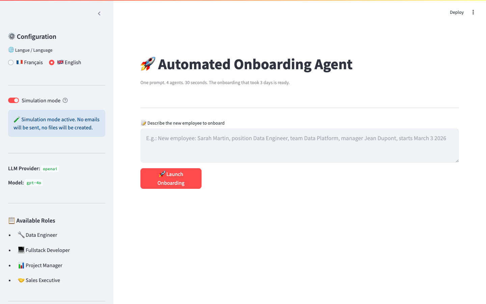
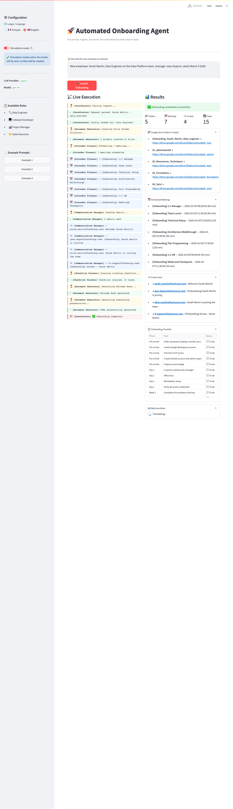
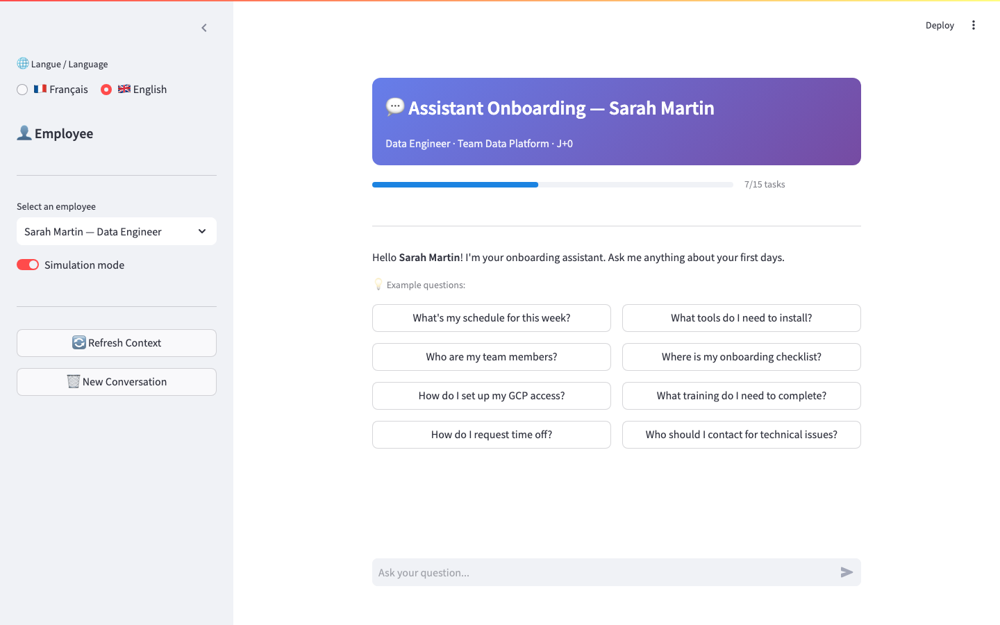

# Automated Onboarding Agent

> Turn one natural-language hiring brief into a coordinated onboarding workspace.

An English-first Streamlit application that orchestrates employee onboarding across Google Drive, Calendar, Gmail, and Sheets, while producing a welcome book, presentation, checklist, and employee assistant. It includes a simulation mode for demos and a personal OAuth2 path for real Google actions.

## Screenshots

### UI before processing


### UI after processing


### Employee assistant


### Generated artifacts

Add these captures after running one real or simulated onboarding. Keep them sanitized: use placeholder names, addresses, event links, and email content.

| Artifact | Recommended file |
|---|---|
| Generated email | `docs/screenshots/04_generated_email.png` |
| Google Calendar event | `docs/screenshots/05_google_calendar_event.png` |
| Google Sheets checklist | `docs/screenshots/06_google_sheets_checklist.png` |

## What happens

Enter a brief such as:

> Sarah Martin, Data Engineer on the Data Platform team, managed by Jean Dupont, starting March 3 2026.

The coordinator then:

1. Parses the brief with the selected LLM.
2. Creates an onboarding folder structure in Drive.
3. Plans first-week Calendar meetings.
4. Sends welcome, manager, team, and IT emails.
5. Creates a phased Google Sheets checklist.
6. Renders a personalized Welcome Book.
7. Generates a downloadable HTML presentation.

The employee assistant injects the employee's role, schedule, checklist, contacts, access, training, tools, and welcome book into a conversational context.

## Architecture

```text
Streamlit admin dashboard       Streamlit employee assistant
              \                  /
               Coordinator agent
                       |
       LLM abstraction + role/org YAML config
                       |
     Drive | Calendar | Gmail | Sheets connectors
                       |
       Simulation adapters or personal OAuth2
```

The pipeline is intentionally modular: UI, orchestration, LLM access, Google connectors, and business configuration can be replaced independently.

## Quick start

### Requirements

- Docker Desktop with Compose, or Python 3.12+
- An API key for Anthropic, OpenAI, or an OpenAI-compatible provider
- Google account and OAuth2 client only for real mode

### Run with Docker

```bash
git clone https://github.com/YOUR_USERNAME/ai-onboarding-agent.git
cd ai-onboarding-agent
Copy-Item .env.example .env
```

Open `.env` and set one provider:

```env
LLM_PROVIDER=openai_compatible
OPENAI_API_KEY=replace-with-your-key
OPENAI_BASE_URL=https://api.groq.com/openai/v1
OPENAI_MODEL=your-model
```

Start the two services:

```bash
docker compose up --build
```

Open:

- Admin dashboard: <http://localhost:8501>
- Employee assistant: <http://localhost:8502>

Simulation mode is enabled by default and does not send email or create Google artifacts.

### Run without Docker

```powershell
python -m venv .venv
.venv\Scripts\Activate.ps1
pip install -r requirements.txt
streamlit run app.py --server.port 8501
```

Run the assistant in a second terminal:

```powershell
streamlit run app_assistant.py --server.port 8502
```

## Real Google mode

Read [SETUP_OAUTH.md](SETUP_OAUTH.md) for the complete Google Cloud setup. The short flow is:

1. Enable Drive, Calendar, Gmail, and Sheets APIs.
2. Create an external OAuth consent screen and add yourself as a test user.
3. Download a Desktop OAuth client to `credentials/oauth_client.json`.
4. Run `python authorize_google.py` on the host.
5. Start the app and disable Simulation Mode.

Real mode can create folders, calendar events, emails, and spreadsheets in the Google account used for authorization. Use a test account first.

The committed `config/org_chart.yaml` contains public placeholder addresses such as `manager@example.com`. Replace them with your own test addresses locally before using real mode; never commit personal addresses or credentials.

## Providers

| Provider | Required variables |
|---|---|
| Anthropic | `ANTHROPIC_API_KEY`, `ANTHROPIC_MODEL` |
| OpenAI | `OPENAI_API_KEY`, `OPENAI_MODEL` |
| OpenAI-compatible | `OPENAI_API_KEY`, `OPENAI_BASE_URL`, `OPENAI_MODEL` |

## Preconfigured roles

Data Engineer, Fullstack Developer, Project Manager, and Sales Executive are defined in `config/roles.yaml`. Add a role by extending YAML configuration rather than changing orchestration code.

## Repository map

```text
app.py                         Admin dashboard
app_assistant.py               Employee assistant
agents/coordinator.py          Main seven-step orchestrator
agents/onboarding_assistant.py Context-aware employee chatbot
llm_client.py                  Provider abstraction
mcp_tools/                     Drive, Calendar, Gmail, Sheets, OAuth2
config/                        Role and organization configuration
templates/                     Welcome book, presentation, job descriptions
docs/screenshots/              Sanitized product screenshots
SETUP_OAUTH.md                 Google OAuth2 instructions
```

## Security checklist before publishing

Do this before the first push:

1. Revoke and rotate any API key that has ever been stored in `.env` or pasted into chat, terminals, screenshots, or commits.
2. Revoke the exposed Google OAuth client if it was shared outside your machine, then download a new client.
3. Delete local `credentials/token.json` and re-authorize after rotation.
4. Confirm `.env`, `credentials/`, `data/`, and JSON secrets are ignored.
5. Search the complete repository, including hidden files, for keys, tokens, passwords, and private emails.
6. Review `git status` and `git diff --cached` before pushing.

PowerShell checks:

```powershell
git status --short --ignored
git ls-files | Select-String -Pattern '(^|/)(\.env|credentials/|.*token.*\.json)$'
Get-ChildItem -Force -Recurse -File | Select-String -Pattern 'sk-|gsk_|client_secret|private_key|refresh_token|password' -CaseSensitive:$false
```

The second command should print nothing. Never commit `.env`, `credentials/oauth_client.json`, `credentials/token.json`, or real contact data.

## License

See [LICENSE](LICENSE).

This Docker Compose is designed as a foundation. Each layer is replaceable without touching the others:

- **Infrastructure** — Deploy each agent in its own Kubernetes container. Auto-scaling, health checks, rolling updates.
- **Security & IAM** — Azure AD / Okta / Google Workspace integration. Dedicated service accounts with least privilege.
- **Observability** — Centralized LLM interaction logging, cost dashboards, anomaly alerts.
- **Multi-tenancy** — One platform, multiple organizations, data isolation via YAML contracts.
- **HRIS Integration** — Trigger from BambooHR / Workday / SAP SuccessFactors webhooks instead of Streamlit.

---

## License

MIT — see [LICENSE](LICENSE)

---

*Built to demonstrate that industrializing AI is not a model problem — it's an architecture, integration, and governance problem.*
